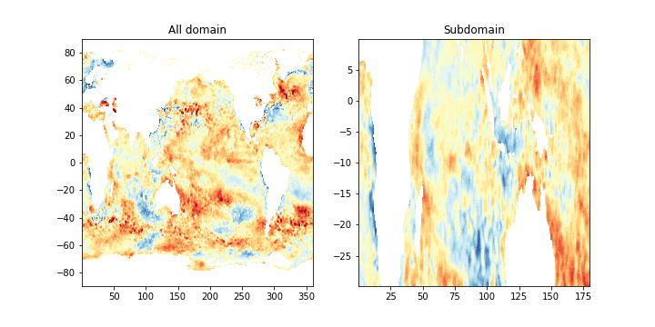

# Artools

## What is it about? 

Artools is just some usefull scripts to compute interannual anomalies of a timeserie and take subdomains of a large dataset.

## Example 




## Installation 
Create an environment :
```bash
conda create -n Artools_env
```


Then install Artools : 
```bash
source activate Artools_env
pip install git+https://github.com/aprig/Artools.git
```
